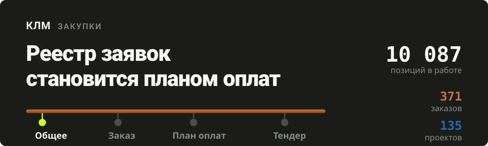
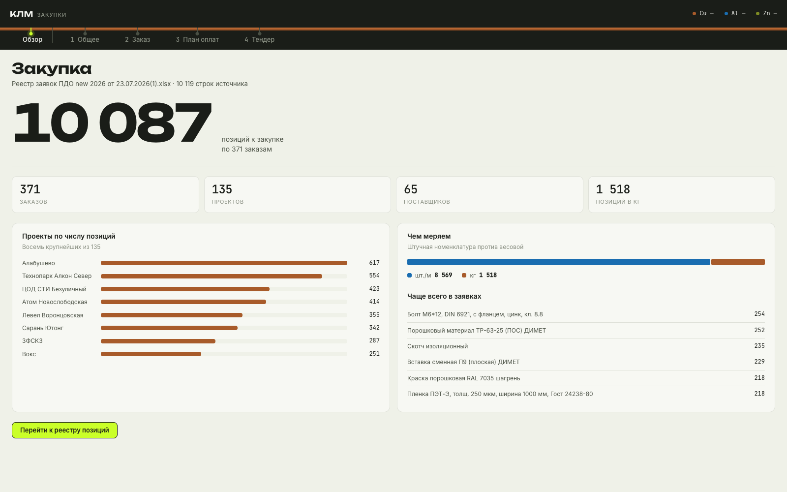
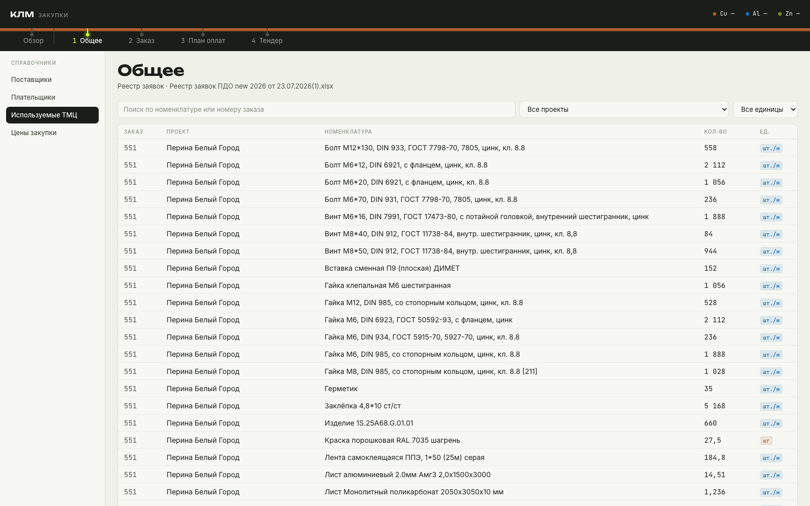
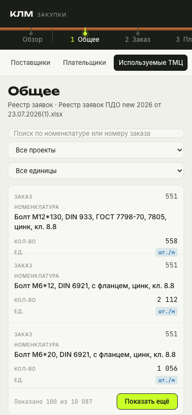

# Панель закупок КЛМ

Реестр заявок ПДО, поставщики и счета в одном интерфейсе. Панель собирает 10 087 позиций из 371 заказа по 135 проектам и ведёт их по четырём этапам: справочники → заказ → план оплат → тендер.

Компания производит шинопроводы и троллейные системы, поэтому закупка здесь — это медь, алюминий и цинк, а закупочная цена ходит за биржевой котировкой металла. Интерфейс построен вокруг этого: единица измерения окрашена по материалу, навигация идёт по медной шине.

## Как это выглядит

**Обзор** — сводка по всей закупке: сколько позиций в работе, какие проекты крупнейшие, чем меряем номенклатуру.



**Реестр позиций** — 10 087 строк с поиском, фильтрами по проекту и единице, порционной загрузкой.



<table>
<tr>
<td width="42%"></td>
<td valign="top">

**На телефоне** таблица превращается в карточки: пять колонок в 390 пикселей не помещаются, поэтому вместо горизонтальной прокрутки строка разворачивается по вертикали, а второстепенные поля скрываются.

Проверено на трёх ширинах — 390, 834 и 1600.

</td>
</tr>
</table>

## Запуск

Нужен Node.js 24 или новее.

```bash
cd web
npm install
npm run data     # достаёт данные из HTML-прототипа в public/data
npm run dev
```

Панель откроется на `http://localhost:5173`. Лендинг — на корневом адресе, рабочая панель — по `#panel`.

Сборка статики, которую можно положить на любой хостинг:

```bash
npm run build    # -> web/dist
```

## Что внутри

| Путь | Что там |
| --- | --- |
| `web/` | React + TypeScript + Vite, статическая сборка |
| `web/scripts/extract-data.mjs` | достаёт данные из HTML-прототипа в JSON |
| `prototype/` | исходный HTML-прототип панели |
| `istochniki/` | исходные xlsx, pdf и csv: реестры, счета, сальдо, плательщики |
| `server/` | Node-сервер первого этапа: health-check, аудит, резервные копии |
| `docs/` | техническое задание |

Внутри `web/src` слои разведены так, чтобы код не сваливался в одну папку по мере роста:

```
app/       точка входа, роутинг, глобальные стили
pages/     экраны: лендинг, обзор, общее
widgets/   составные блоки: шина
shared/    ui-примитивы, доступ к данным, утилиты
```

## Решения, которые стоит знать

**Данные вынесены из разметки.** Прототип держал 923 KB данных прямо в HTML — 79% файла. Теперь они лежат в `public/data/*.json` и грузятся отдельно: 1252 KB превращаются в 109 KB под gzip и кэшируются браузером.

**Таблица не рендерит всё сразу.** Список выдаётся страницами по 100 строк с имитацией серверной задержки — есть и кнопка «Показать ещё», и автодогрузка по скроллу. Поверх этого работает виртуализация: в DOM держится около тридцати строк независимо от того, сколько загружено.

**Палитра проверена, а не подобрана на глаз.** Цвета металлов прошли проверку на цветовую слепоту: худшая соседняя пара даёт ΔE 20.0 при протанопии и 24.7 при нормальном зрении. Алюминию пришлось дать холодный синий — серебристо-серый физически честнее, но как категориальный код он неразличим.

**Котировки металлов показывают прочерк.** Источник Westmetall ещё не подключён, и выдумывать цену металла нельзя: на ней стоит вся закупка.

## Состояние

Готовы лендинг, обзор и раздел «Общее» с реестром позиций и справочником поставщиков. Этапы «Заказ», «План оплат» и «Тендер» ещё переносятся с прототипа. Плательщики и ценообразование ждут разбора своих источников.

Авторизации нет — это решение заказчика на время демонстрации. Пока она не появится, публиковать панель в открытый доступ нельзя: в ней платежи, поставщики и суммы.
